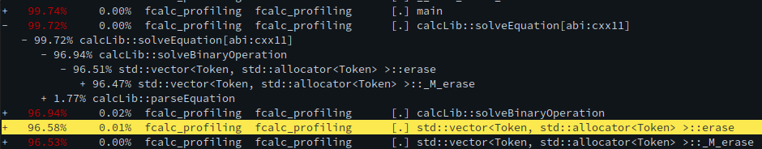

#### IVS profiling - Fitutubies

##### Výstup měření
Kalkulačka tráví 85-95% času mazáním prvků vektoru. Důvodem je, že po smazání
prvku z vektoru se musí ostatní prvky přesunout doleva aby opět vznikla
nepřerušovaná pamět. Protože prvky vektoru jsou v programu často mazány od
začátku dochází k tomu že každý prvek se bude přesunovat až tolikrát na kolikáté
pozici leží.

##### Možná řešení

Ideálním řešením by bylo přepsat knihovnu aby používala bottom-up parser.
To byl také původní plán ale z časových (a znalostních) důvodu jsem byl nucen přejít
na jednoduší variantu.

Existující kód by měl jít přepsat tak aby používal std::list který má O(1)
časovou komplexitu při mazání prvku uprostřed seznamu.
